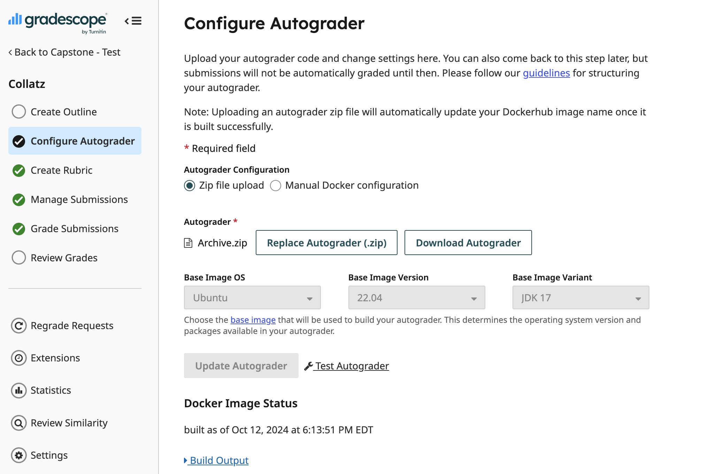
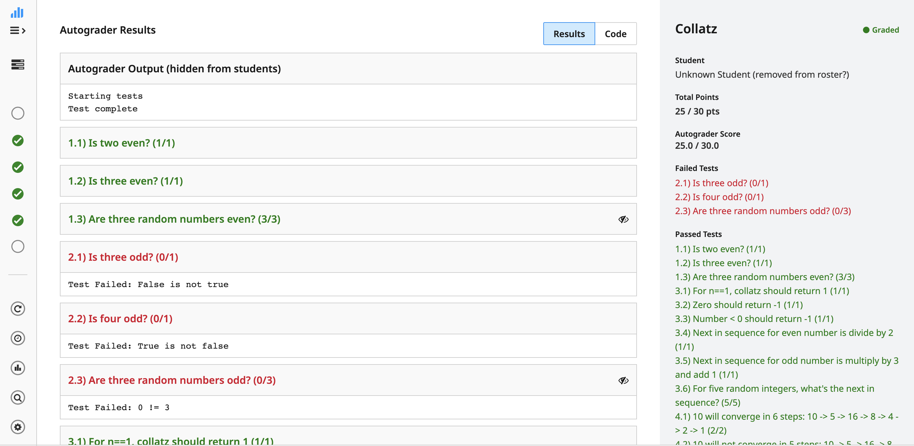

# collatz-py4j example

## Upload to Gradescope

Create a programming assignment.

Choose the Autograder.zip file in your upload. Choose whatever JDK is expected (we're using the latest).

From there, you can test the autograder by uploading your own solution. It will run and hopefully produce an output:

You can ssh into the autograder if you'd like to debug.