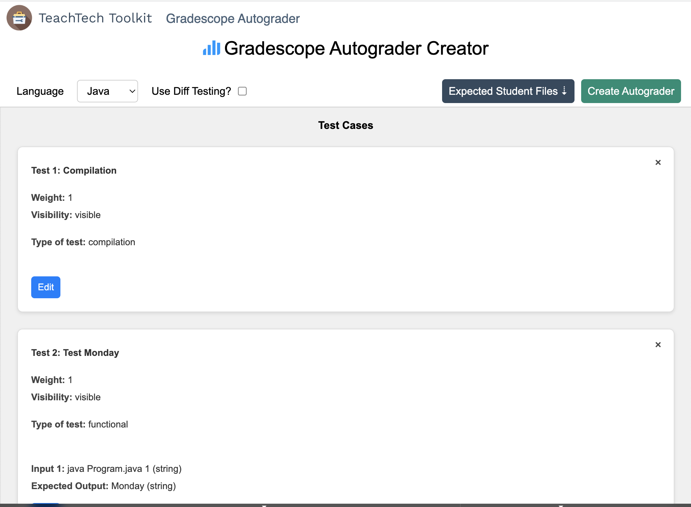
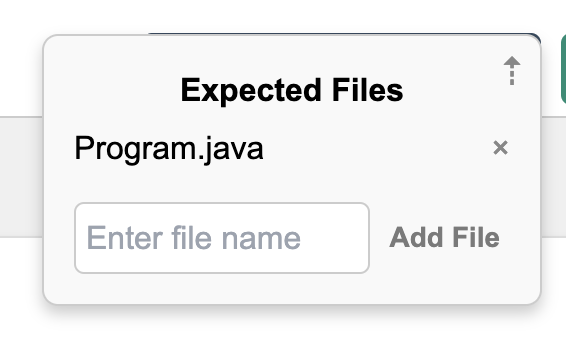
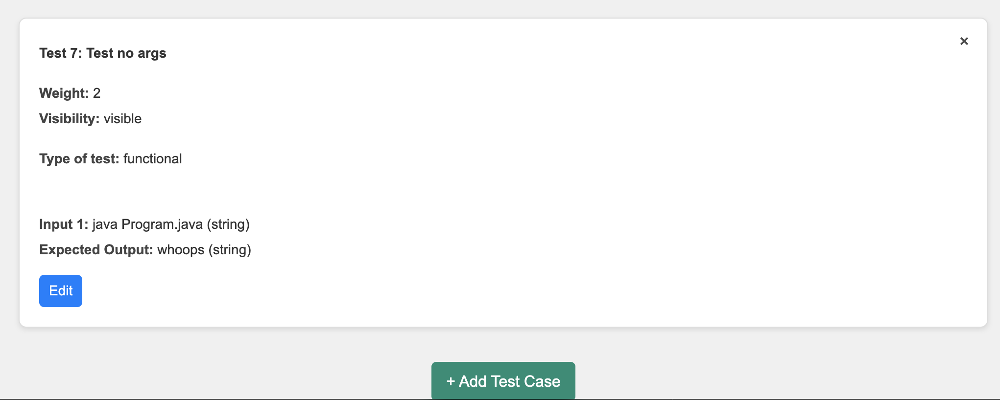
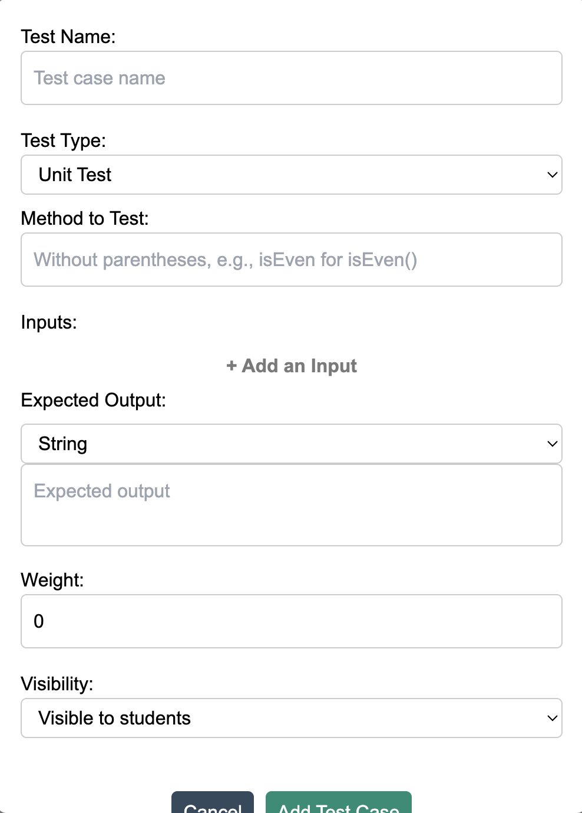
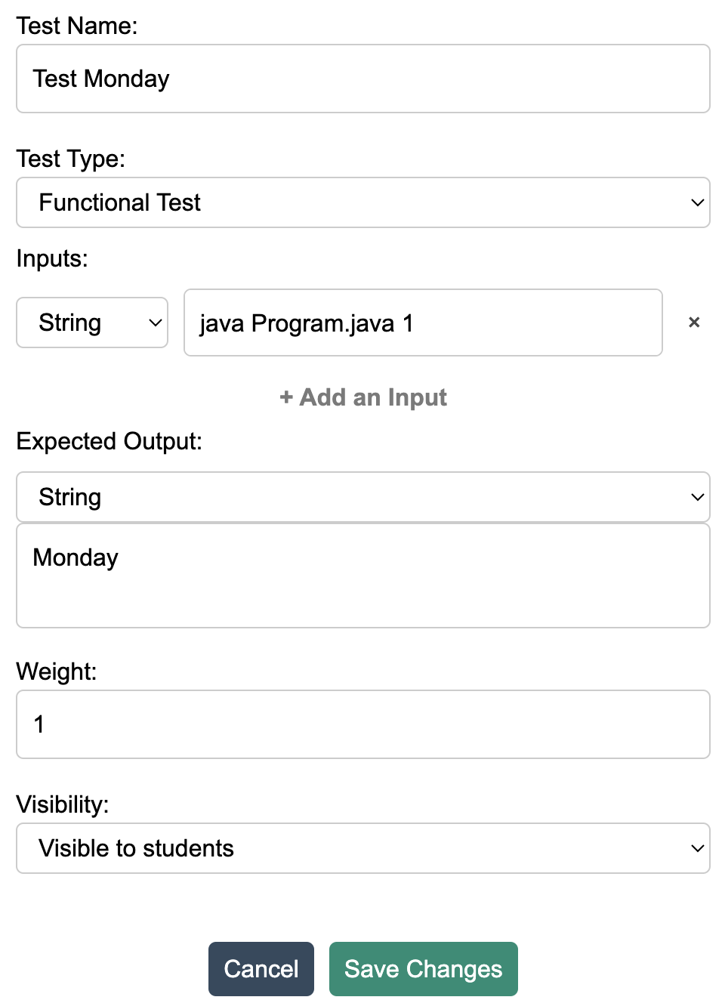
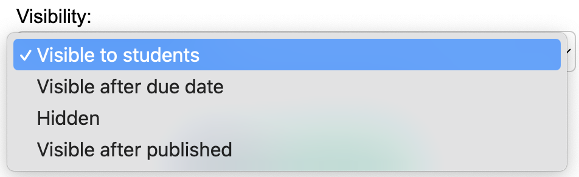
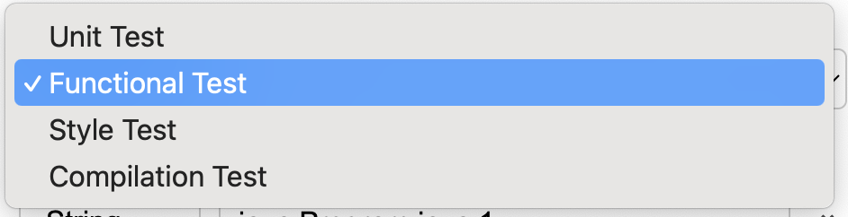
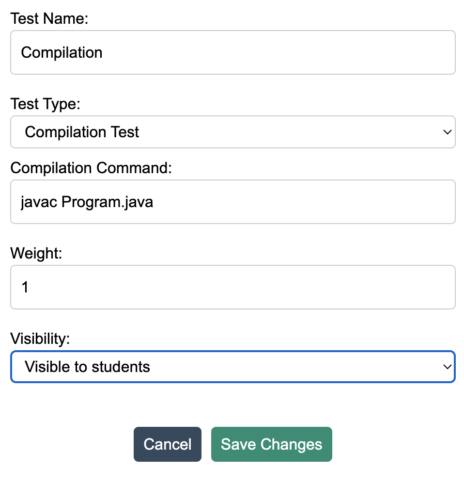

# weekdays-generation

This sample assignment is a proof-of-concept of autograder creation and generation. 

## File structure

### Root: Program.java

This is reference solution file.

### testenv folder

This is a sample generated autograder, a Program solution, and a Dockerfile that creates some version of Gradescope's test environment. Copy/paste autograder, solutions, etc. for local testing. This should be rebuilt!

### All other folders

We have a bunch of example incorrect submissions with a variety of bugs. Each should be self-explanatory.

## Demo autograder input

In an effort to produce a working autograder, below is our known-working frontend input. Most deviations from this will probably break things!

### Initial screen



The language choice and diff testing options don't really do anything at this time.

### Expected files

Student-submitted files are located in the `submissions` folder. This option takes the path of the requisite files to grade so it can be copied to the autograder environment.



### New test case

At the bottom of the autograder creation tool, new test cases can be added.



This is an example of the default blank test case.



### Options

For our demo, we focused on a subset of test options that we could guarantee to work. Below is one of them:



Essentially, this test will run the input string in the command line and record stdout/stderr. It will then attempt to match stdout with the provided expected output. If the two match, the test passes.

Gradescope provides some options (decorators in testcase scripts) that adjusts how each test is graded/shown. `Test Name` is what will be presented to students for each test. `Weight` defines the point value for the test. `Visibility` options are defined by Gradescope and determine if/when students see what test cases are run and their results.



We also defined types of tests that can be run. This would change the test case's functionality to align with the chosen method. We have implemented `Functional` which for now is defined as a command-line output diffcheck test. These should be expanded and corrected.



### Pre-tests

`Unittest` runs asynchronously, meaning it does not guarantee any execution order. Often, instructors would want to check for file existence or if the program compiles; if not, it can immediately error out to the student and not waste time on other tests that are guaranteed to fail. We have implemented two types of pretests: expected file checking (using input from [Expected Files](#expected-files)) and compilation, which runs a given command and checks if there's any stderr.



Our autograder harness is designed to run two sets of tests and parse the output JSON accordingly. Unfortunately, we've had trouble getting our suite to discover/run anything other than the standard `test*.py` (in our case, `pretest*.py`). Please fix!

---
### Request from frontend

This is a serialized example of our demo testcase. You can use it to recreate our demo in the webapp interface or otherwise pass it locally in backend testing.

```
server  | Received autograder.
server  | Language: Java
server  | Test Cases: [{‘name’: ‘Compile’, ‘type’: ‘compilation’, ‘method’: None, ‘inputs’: None, ‘output’: None, ‘weight’: 1, ‘visibility’: ‘visible’, ‘styleCheck’: None, ‘compilationCommand’: ‘javac Program.java’}, {‘name’: ‘Test Monday’, ‘type’: ‘functional’, ‘method’: None, ‘inputs’: [{‘value’: ‘java Program.java 1’, ‘type’: ‘string’}], ‘output’: {‘value’: ‘Monday’, ‘type’: ‘string’}, ‘weight’: 1, ‘visibility’: ‘visible’, ‘styleCheck’: None, ‘compilationCommand’: None}, {‘name’: ‘Test Tuesday’, ‘type’: ‘functional’, ‘method’: None, ‘inputs’: [{‘value’: ‘java Program.java 2’, ‘type’: ‘string’}], ‘output’: {‘value’: ‘Tuesday’, ‘type’: ‘string’}, ‘weight’: 1, ‘visibility’: ‘visible’, ‘styleCheck’: None, ‘compilationCommand’: None}, {‘name’: ‘Test Sunday’, ‘type’: ‘functional’, ‘method’: None, ‘inputs’: [{‘value’: ‘java Program.java 7’, ‘type’: ‘string’}], ‘output’: {‘value’: ‘Sunday’, ‘type’: ‘string’}, ‘weight’: 1, ‘visibility’: ‘visible’, ‘styleCheck’: None, ‘compilationCommand’: None}, {‘name’: ‘Test out-of-bounds’, ‘type’: ‘functional’, ‘method’: None, ‘inputs’: [{‘value’: ‘java Program.java 0’, ‘type’: ‘string’}], ‘output’: {‘value’: ‘Doomsday’, ‘type’: ‘string’}, ‘weight’: 2, ‘visibility’: ‘visible’, ‘styleCheck’: None, ‘compilationCommand’: None}, {‘name’: ‘Test bad args’, ‘type’: ‘functional’, ‘method’: None, ‘inputs’: [{‘value’: ‘java Program.java “one”’, ‘type’: ‘string’}], ‘output’: {‘value’: ‘Nice try’, ‘type’: ‘string’}, ‘weight’: 2, ‘visibility’: ‘visible’, ‘styleCheck’: None, ‘compilationCommand’: None}, {‘name’: ‘Test no args’, ‘type’: ‘functional’, ‘method’: None, ‘inputs’: [{‘value’: ‘java Program.java’, ‘type’: ‘string’}], ‘output’: {‘value’: ‘whoops’, ‘type’: ‘string’}, ‘weight’: 2, ‘visibility’: ‘visible’, ‘styleCheck’: None, ‘compilationCommand’: None}]
server  | Use Diff Testing: false
server  | Solution File: None
server  | Expected Files: [‘Program.java’]
```